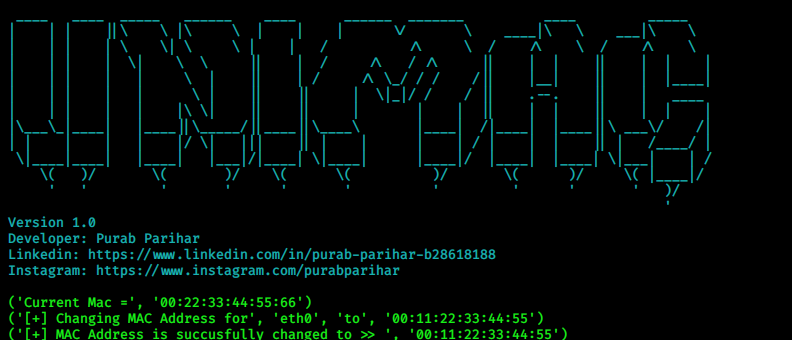

# UniMac
# Hello Folks! We are here with intresting topic
# Great tool to change mac address 
# Here we Go...

## Installation

```bash
git clone https://github.com/purabparihar/UniMac-Mac-Address-Changer.git
cd UniMac-Mac-Address-Changer
```


## Usage
```
python UniMac -i [Your_Interface] -m [Your New MAC Address]
```
## Best of Luck

## License
[GNU General Public License v3.0]

## Created by Purab Parihar
